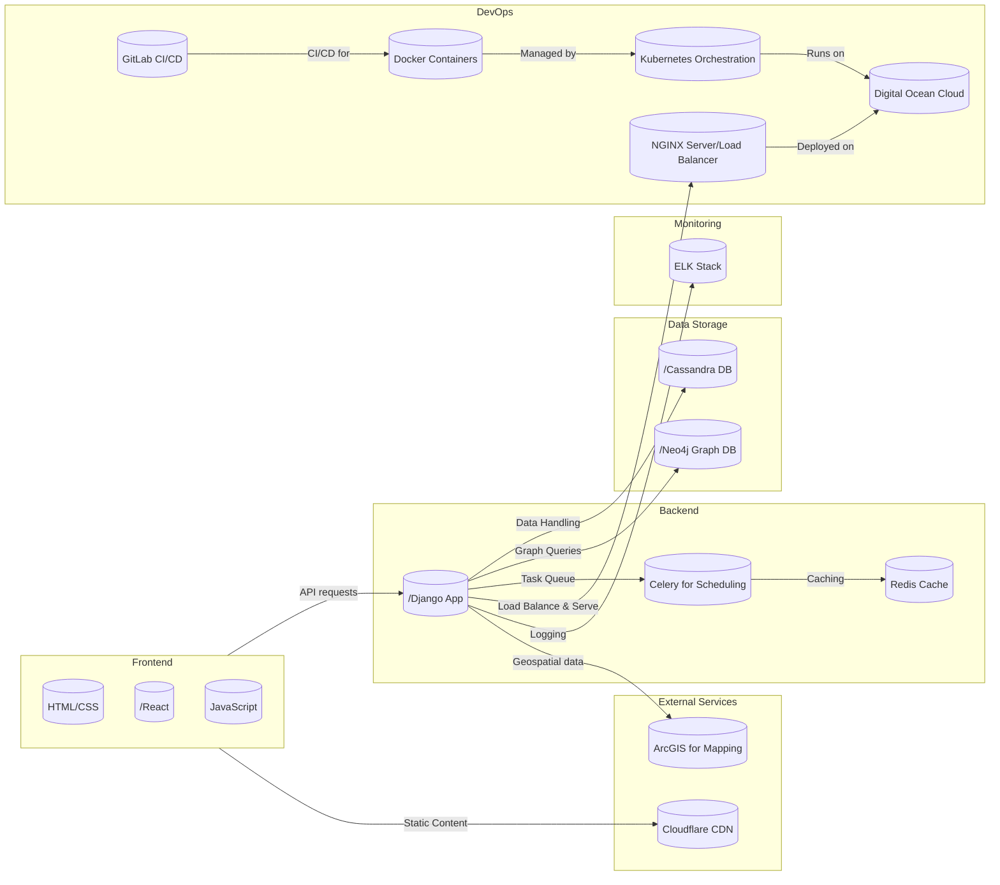

# project artemis

## Getting started

## making changes

```
git clone https://gitlab.com/cercleholdings/artemis.git
git checkout -b <mybranchname>
Make your changes in the code.
git add <myfiles> or git add .
git commit -m 'commit message'
git pull origin main
git push origin <mybranchname>
```
Merge Requests require approval before being commited.
Notify maintainer

## Software Architecture


